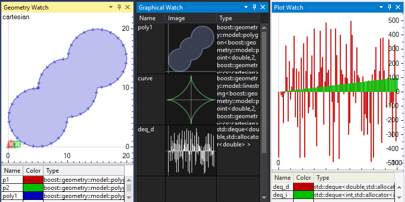
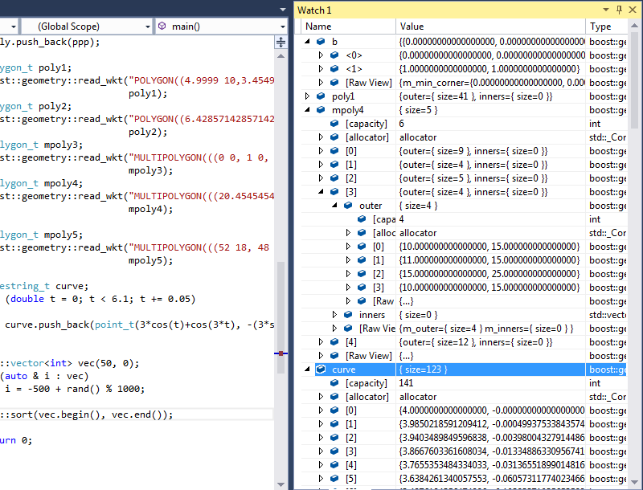
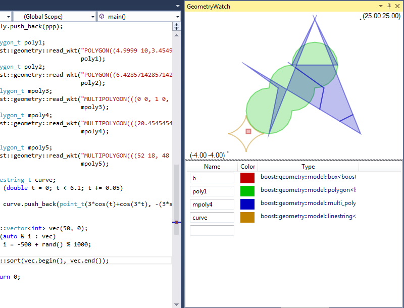
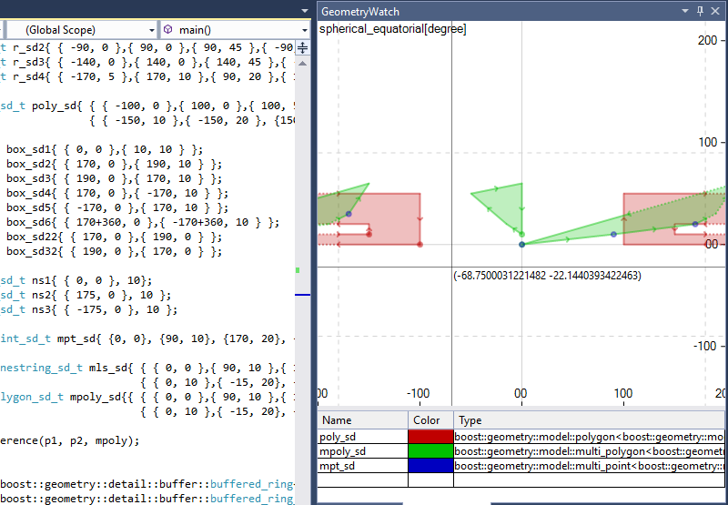
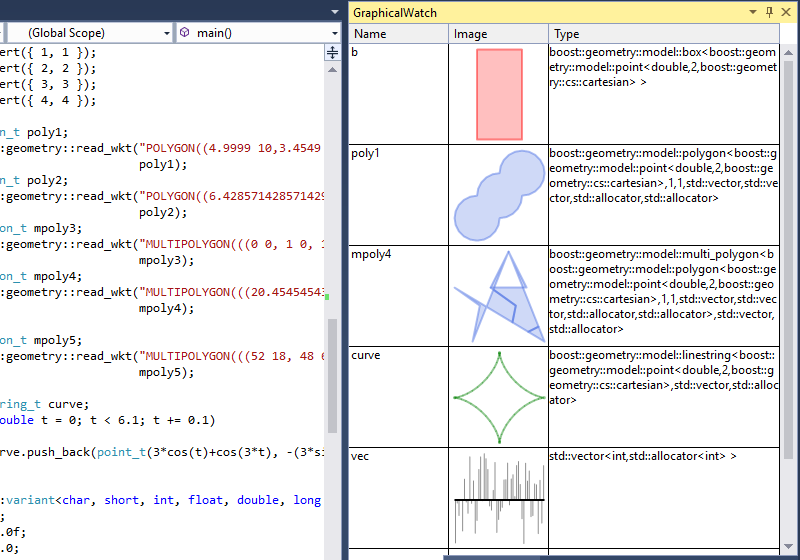
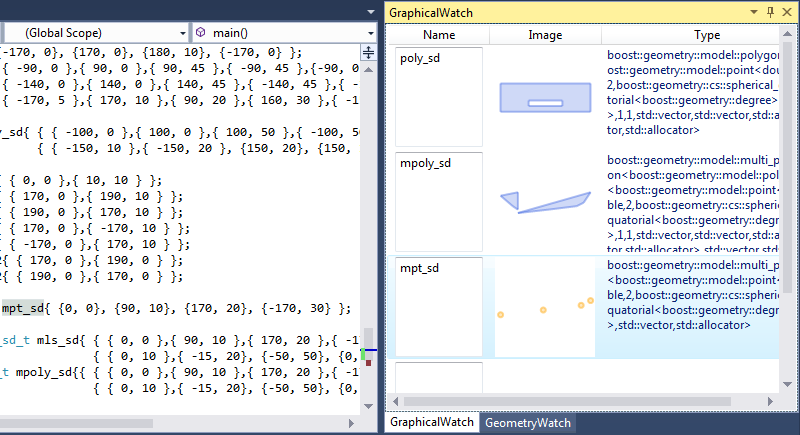
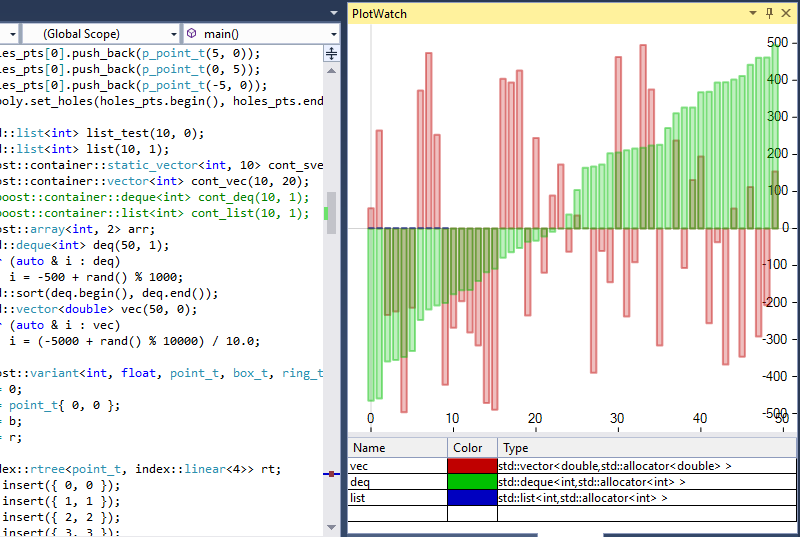
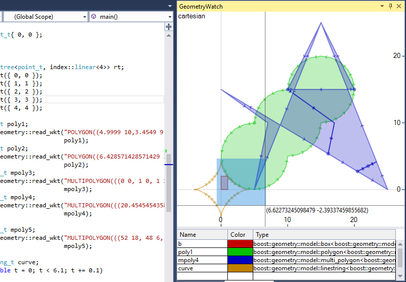
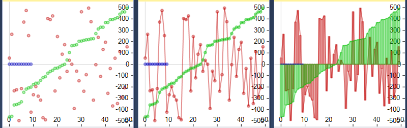

# Graphical Debugging
## extension for Visual Studio 2013, 2015, 2017 and 2019

This extension allows to display graphical representation of C++ and C# variables during debugging.



It supports Boost.Geometry and Boost.Polygon models, Boost.Variant, STL/Boost containers of values and points, C-style arrays, C# arrays, List and LinkedList as well as user-defined geometry types. The extension has the following components:

* **Debugger visualizers** for Boost.Array, Boost.CircularBuffer, Boost.Container, Boost.Geometry, Boost.MPL, Boost.Polygon, Boost.Tuple and Boost.Variant
* **Geometry Watch** tool window displaying geometries in a common coordinate system, e.g. Boost.Geometry, Boost.Polygon polygons, etc.
* **Graphical Watch** tool window displaying graphical representation of variables, e.g. Boost.Geometry models, Boost.Gil images, vectors of values, etc.
* **Plot Watch** tool window displaying plot representation of variables, e.g. vector of doubles, array of pairs, etc.

Feel free to report bugs, propose features and create pull requests. Any help is appreciated.

##### Download

You can download this extension from [Visual Studio Marketplace](https://marketplace.visualstudio.com/items?itemName=AdamWulkiewicz.GraphicalDebugging) or [GitHub](https://github.com/awulkiew/graphical-debugging/releases).

##### Instructions

###### Build

You need Microsoft Visual Studio 2017 Community and .NET Framework 4.5.2.

###### Install

To install after building double-click the *.vsix file from bin/Debug or bin/Release directory.

###### Use

1. place a breakpoint somewhere in the code
2. start debugging
3. after a breakpoint hit enable the tool window from the menu
   * **View**->**Other Windows**->**Geometry Watch**
   * **View**->**Other Windows**->**Graphical Watch**
   * **View**->**Other Windows**->**Plot Watch**
4. write the name of a variable in an edit box on the list

#### Details

##### Debugger visualizers

Supported:

* Boost.Array: array
* Boost.CircularBuffer: circular_buffer
* Boost.Container: vector, static_vector
* Boost.Geometry:
  * de9im: mask, matrix, static_mask
  * detail: turn_info, traversal_turn_info, turn_operation, turn_operation_linear, traversal_turn_operation, segment_ratio
  * index: rtree, varray
  * model: point, point_xy, box, segment, referring_segment, polygon, multi_point, multi_linestring, multi_polygon, nsphere
* Boost.MPL: int_, size_t, integral_c, vector, vector_c
* Boost.Polygon: point_data, interval_data, segment_data, rectangle_data, polygon_data, polygon_with_holes_data
* Boost.Tuple: tuple, cons
* Boost.Variant: variant



##### Geometry Watch

Watch window displaying graphical representation of variables in a single image. This allows to compare the variables easily. Variables can be of any supported type (see below) representing a geometrical object, e.g. point, polygon, ray, container of complex numbers, etc.



Geometries in spherical_equatorial and geographic coordinate systems are displayed in a way allowing to see what coordinates were used to define a geometry. Note that various libraries may require coordinates in a certain range. This extension tries to display any coordinates as good as possible.

Segments may be densified in order to reflect the curvature of the globe. This behavior is enabled by default but can be disabled in **Tools**->**Options**->**Graphical Debugging**->**Geometry Watch**.



where geometries are Boost.Geometry types:

    polygon_sd_t poly_sd{{{-100, 0},{100, 0},{100, 50},{-100, 50},{-100, 0}},
                         {{-150, 10},{-150, 20},{150, 20},{150, 10},{-150, 10}}};
    multi_polygon_sd_t mpoly_sd{{{{0, 0},{90, 10},{170, 20},{-170, 30},{-150, 60}},
                                 {{0, 10},{-15, 20},{-50, 50},{0, 60}}}};
    multi_point_sd_t mpt_sd{{0, 0},{90, 10},{170, 20},{-170, 30}};

##### Graphical Watch

Watch window displaying graphical representations of variables in a list. Each variable is placed and visualized in a separate row. Variables can be of any supported type (see below) incl. images (see below).



Geometries in spherical_equatorial and geographic coordinate systems are displayed in a convenient, compact way.

Segments may be densified in order to reflect the curvature of the globe. This behavior is enabled by default but can be disabled in **Tools**->**Options**->**Graphical Debugging**->**Graphical Watch**.



where

    polygon_sd_t poly_sd{{{-100, 0},{100, 0},{100, 50},{-100, 50},{-100, 0}},
                         {{-150, 10},{-150, 20},{150, 20},{150, 10},{-150, 10}}};
    multi_polygon_sd_t mpoly_sd{{{{0, 0},{90, 10},{170, 20},{-170, 30},{-150, 60}},
                                 {{0, 10},{-15, 20},{-50, 50},{0, 60}}}};
    multi_point_sd_t mpt_sd{{0, 0},{90, 10},{170, 20},{-170, 30}};

##### Plot Watch

Watch window displaying plot representation of variables in a single image. Type of plot can be set in **Options**. Variables can be of any supported type (see below) representing a container of values or points incl. complex and pair.



##### Types supported in watch windows

* Containers of values convertible to double, points and other geometries
  * C-style array
  * Pointer to elements with size specifier e.g.: `ptr,5`
  * Sequence of containers of point coordinates e.g.: `vec_x;vec_y`
  * STL: array, vector, deque, list, set
  * Boost.Array: array
  * Boost.CircularBuffer: circular_buffer
  * Boost.Container: vector, static_vector
  * C#: array, List, LinkedList
  * VB: array List (containers of values only)
  * user-defined containers (see below)
* 2D cartesian geometries
  * Boost.Geometry: point, point_xy, box, segment, referring_segment, polygon, multi_point, multi_linestring, multi_polygon, nsphere
  * Boost.Polygon: point_data, segment_data, rectangle_data, polygon_data, polygon_with_holes_data
  * STL: pair
  * user-defined geometry types (see below)
* Non-cartesian geometries (spherical_equatorial and geographic)
  * Boost.Geometry: point, box, segment, referring_segment, polygon, multi_point, multi_linestring, multi_polygon, nsphere
* Spatial indexes
  * Boost.Geometry: rtree
* Complex numbers
  * STL: complex
* Images
  * Boost.Gil: image (incl. typedefs, e.g. rgb8_image_t, abgr16_image_t, cmyk32_image_t, rgb64f_planar_image_t, etc.)
* Variants of geometries
  * Boost.Variant: variant

##### User-defined types

The extension offers support for the following user-defined geometries for both C++ and C# types:

  * Box (aka rectangle)
  * Line
  * Linestring
  * MultiLinestring
  * MultiPoint
  * MultiPolygon
  * Point
  * Polygon (polygon with holes)
  * Ray
  * Ring (polygon without holes)  
  * Segment

as well as user defined containers for C++:

  * Array
  * LinkedList

They can be defined in XML file similar to *.natvis file. Path to this file can be set in options under **Tools**->**Options**->**Graphical Debugging**->**General**. An example XML file defining C++ types `MyPoint`, `MyRing` and `MyPolygon` in global namespace might look like this:

```
<?xml version="1.0" encoding="utf-8"?>
<GraphicalDebugging>

  <Point Id="MyPoint">
    <Coordinates>
      <X>x</X>
      <Y>y</Y>
    </Coordinates>
  </Point>

  <Ring Id="MyRing">
    <Points>
      <Array>
        <Pointer>points_ptr</Pointer>
        <Size>points_size</Size>
      </Array>
    </Points>
  </Ring>

  <Polygon Id="MyPolygon">
    <ExteriorRing>
      <Name>outer</Name>
    </ExteriorRing>
    <InteriorRings>
      <Container>
        <Name>inners</Name>
      </Container>
    </InteriorRings>
  </Polygon>

</GraphicalDebugging>
```

Current limitations:

  * only one entry per type
  * in C# elements stored in containers has to be ValueTypes, Points and Boxes has to be structs

See more [examples at GitHub](https://github.com/awulkiew/graphical-debugging/tree/master/examples).

##### Direct memory access

The extension attempts to obtain data through direct memory access if possible. From this feature benefit all supported containers of fundamental numeric types and geometries using such coordinate types. E.g.:
  * `int arr[5]`
  * `std::array<float, 5>`
  * `std::vector<double>`
  * `std::deque<std::pair<float> >`
  * `std::list<std::complex<double> >`
  * `boost::container::vector<int>`
  * `boost::geometry::model::linestring< boost::geometry::model::point<double, 2, boost::geometry::cs::cartesian> >`
  * `boost::polygon::polygon_data<int>`
  * `double[]` (C#)
  * etc.

This behavior is enabled by default but can be disabled in options under **Tools**->**Options**->**Graphical Debugging**->**General**

##### Zooming/cropping

Geometry Watch and Plot Watch has zooming/cropping feature. Mouse wheel can be used to zoom in/out as well.




##### Options

Options for each Watch can be found under **Tools**->**Options**->**Graphical Debugging**



##### Themes

The extension supports Visual Studio themes. The visualization of variables may be drawn in two versions, dark or light depending on the brightness of the theme background color.

